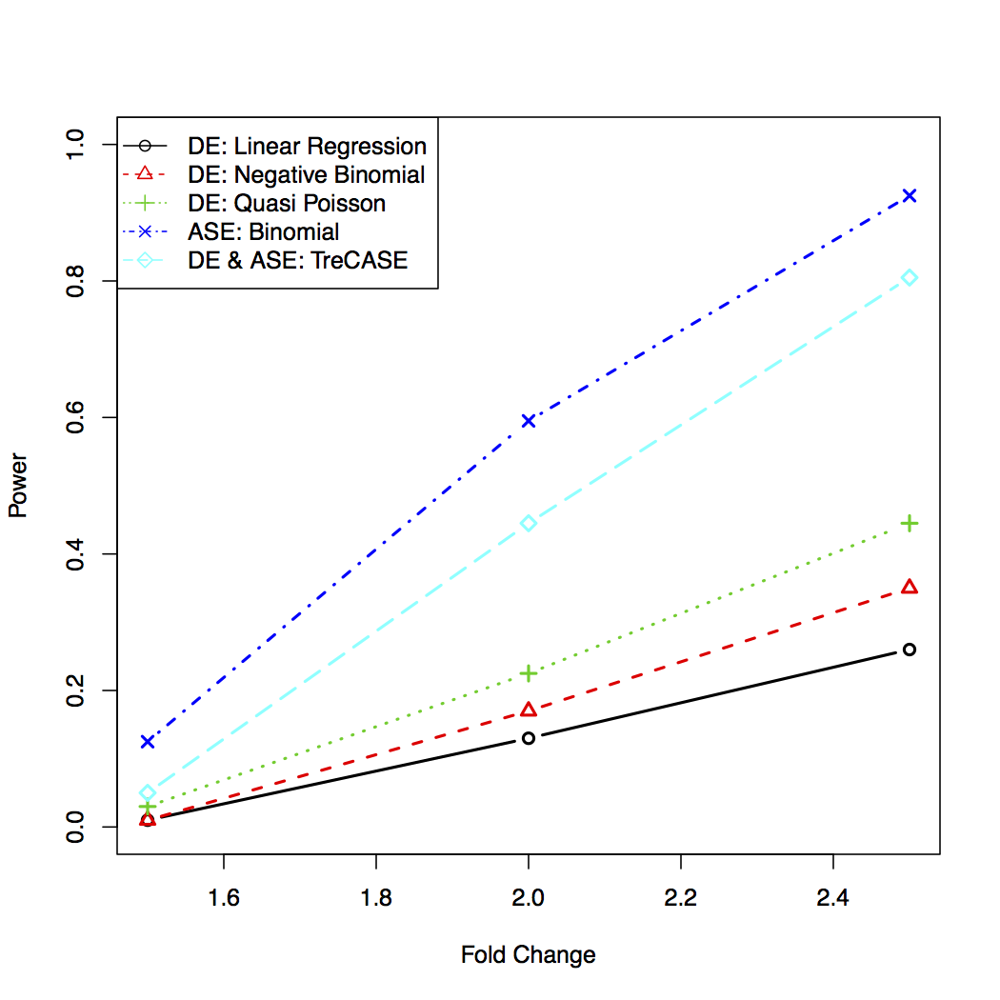

## powerASEeQTL
The powerASEeQTL R package runs power calculations for allele specific expression (ASE) and eQTL analysis using RNA-seq data and creates plots of these results.
#### Installation
```
install.packages("devtools") # devtools must be installed first
install.packages("MASS") #this package must be installed first
install.packages("VGAM") #this package must be installed first

devtools::install_github("SharonLutz/powerASEeQTL")
```
#### Example
The code below creates a plot of the results of the power calculations for eQTL anlaysis using RNA-seq data and the following parameters:
```
library(powerASEeQTL)
?powerASEeQTL # For details on this function and how to customize its graphical output

powerASEeQTL(n = 100, mu = 500, n.simu = 200, legend = TRUE, color = TRUE, 
folds = seq(1.5, 2.5, by = 0.5), alpha = 0.001, phi = 1, theta = 0.1, maf = 0.2, 
numcol = 1, title = "",subtitle = "", titlecolor = "black", subtitlecolor = "black", 
titlesize = 1, subtitlesize = 1, legendbox = "o", labelsize = 1, labelcolor = "black", 
linewidth = 2, tilt = 0)

```

#### Output
For this analysis we get the following results and plot:

  linear negativeB  TReC TReCASE ASEchi2 ASEbinom poisson
1  0.010     0.015 0.015   0.050   0.030    0.025   0.025
2  0.080     0.120 0.125   0.405   0.105    0.175   0.155
3  0.255     0.390 0.410   0.810   0.420    0.470   0.445



#### Reference
Lutz SM, Thwing A, Fingerlin TE. (2017) Power Calculations for eQTL Mapping and Allele Specific Expression with RNA-seq Data. (In Preparation)
